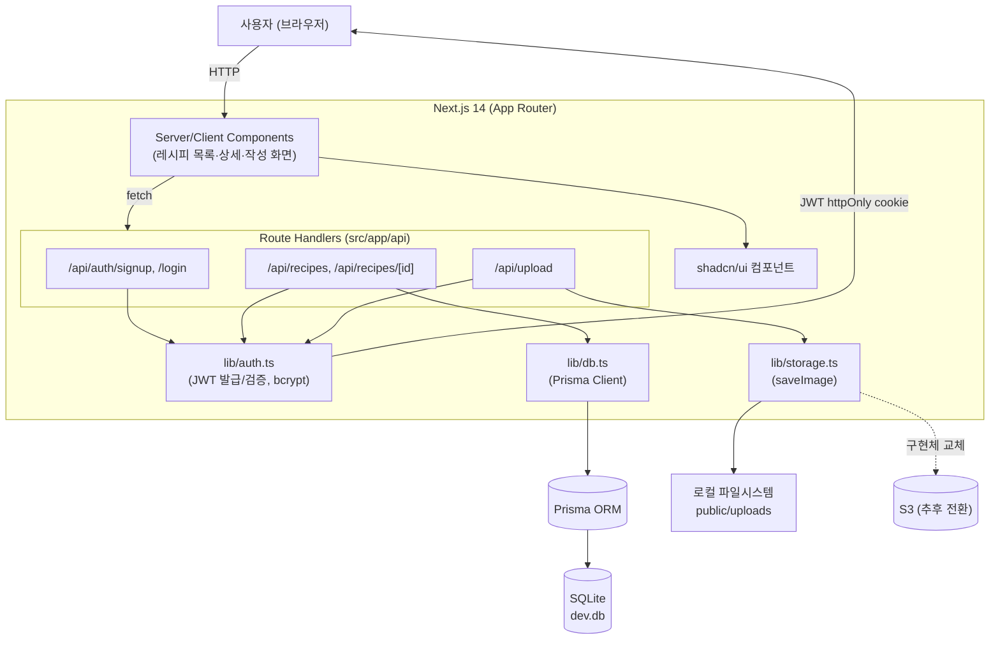
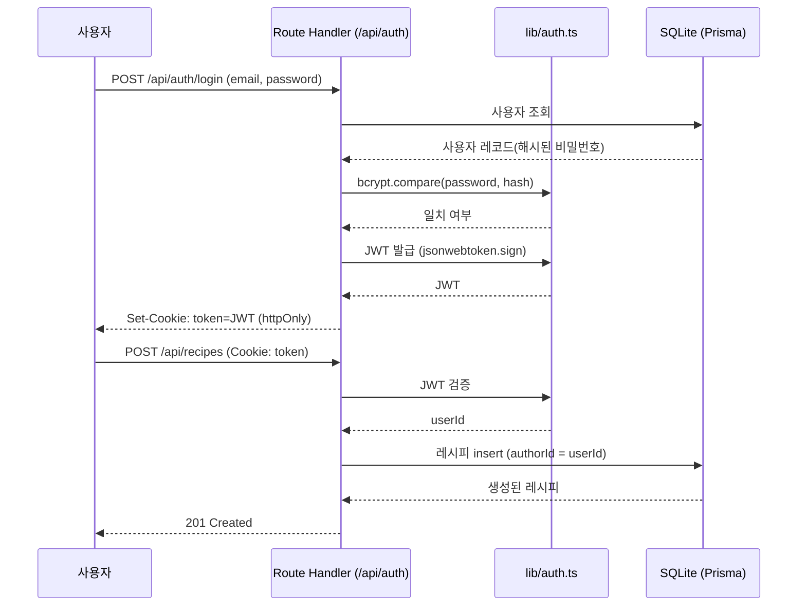

# 아키텍처 다이어그램

Next.js 14(App Router) 단일 앱으로 프론트엔드와 API를 함께 서빙하는 구조입니다.
별도 백엔드 서버 없이 Route Handler가 API 역할을 겸합니다.

## 전체 구조

## 인증 흐름 (JWT)

## 레이어별 책임

| 레이어  | 위치                           | 책임                                                               |
| ------- | ------------------------------ | ------------------------------------------------------------------ |
| UI      | `src/app/**/*.tsx` + shadcn/ui | 화면 렌더링, 사용자 입력                                           |
| API     | `src/app/api/**/route.ts`      | 요청 검증, 인증 확인, 도메인 로직 호출                             |
| Auth    | `src/lib/auth.ts`              | JWT 발급/검증, 비밀번호 해시                                       |
| Data    | `src/lib/db.ts` + Prisma       | SQLite 접근, 모델(User/Recipe)                                     |
| Storage | `src/lib/storage.ts`           | 이미지 저장 — 지금은 로컬, `saveImage()` 내부만 교체하면 S3로 전환 |

## 확장 포인트

- **DB**: Prisma datasource를 `sqlite` → `postgresql`로 바꾸면 스키마 변경 없이 이전 가능
- **Storage**: `lib/storage.ts`의 `saveImage()` 시그니처(`Promise<string>` URL 반환)만 유지하면 내부 구현을 S3 SDK 호출로 교체 가능, 호출부(API 라우트)는 무수정
